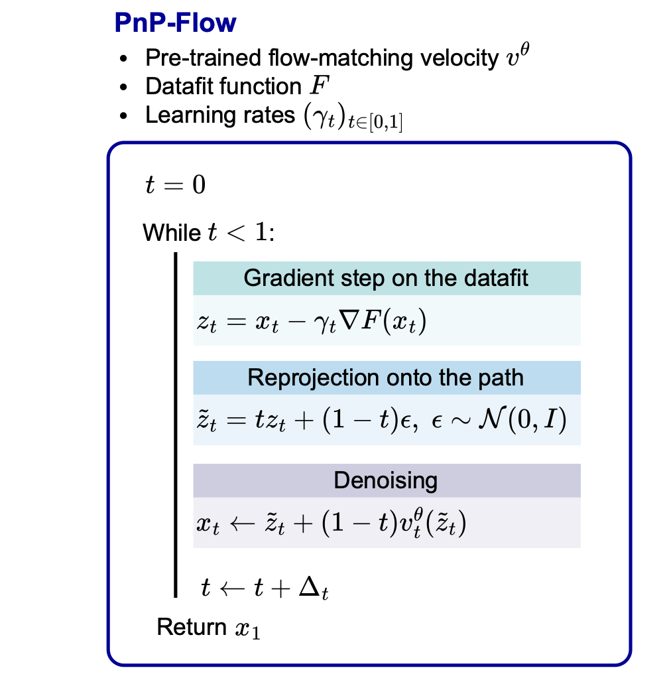
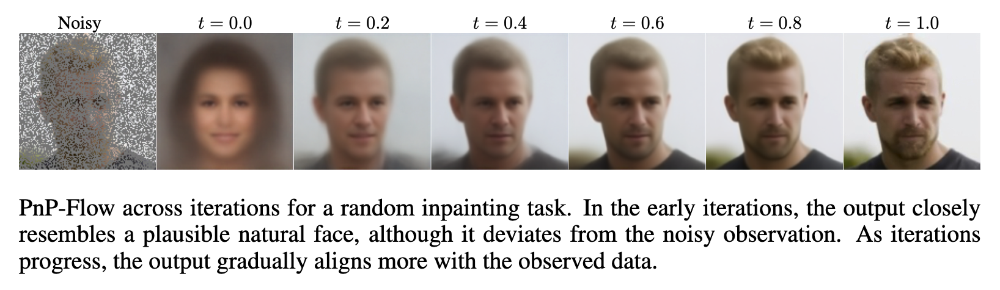

# PnP-Flow

This GitHub repository contains the code for our ICLR 2025 PnP-Flow [paper](https://arxiv.org/pdf/2410.02423), a method combining PnP methods with Flow Matching pretrained models for solving image restoration problems. **Try out the [demo](https://github.com/annegnx/PnP-Flow/blob/main/demo/demo.ipynb)!**




## 1. Getting started
To get started, clone the repository and install ```pnpflow``` via pip

```
cd PnP-Flow
pip install -e .
```
### 1.1. Requirements

- torch 1.13.1 (or later)
- torchvision
- tqdm
- numpy
- pandas
- pyyaml
- scipy
- torchdiffeq
- deepinv

### 1.2. Download datasets
To download the datasets, we follow the guidelines of https://github.com/clovaai/stargan-v2.
The downloaded datasets should be placed in the folder data/ the following way:

    .
    ├── ...
    ├── data
    │   ├── mnist
    │   ├── celeba
    └── ...

The dataset AFHQ-Cat doesn't have a validation split. To create the same split as we did for our experiments, run ```scripts/afhq_validation_images.bash```.

### 1.3. Download pre-trained models
We provide the following pre-trained OT Flow Matching models (U-Net):
- [CelebA](https://drive.google.com/file/d/1ZZ6S-PGRx-tOPkr4Gt3A6RN-PChabnD6/view?usp=drive_link)
- [AFHQ-Cat](https://drive.google.com/file/d/1FpD3cYpgtM8-KJ3Qk48fcjtr1Ne_IMOF/view?usp=drive_link)
- [MNIST-Dirichlet](https://drive.google.com/file/d/1If5gkWEfChJHc8v8CCEhGhEeeAqsxKTz/view?usp=drive_link)

And the denoisers for the PnP-GS method:
- [CelebA](https://drive.google.com/file/d/1ZqBeafErEogaXFupW0ZSLL7P9QoRA-lN/view?usp=drive_link)
- [AFHQ-Cat](https://drive.google.com/file/d/17AXI9p17c7h_xaI19qDcTT2u9_wu0DQY/view?usp=drive_link)

## 2. Training

You can also use the code to train your own OT Flow Matching model.

You can modify the config options directly in the main_config.yaml file located in ```config/```. Alternatively, config keys can be given as options directly in the command line.

For example, to train the generative flow matching model (here, the U-net is the velocity) on CelebA, with a Gaussian latent distribution, run:
```python
python main.py --opts dataset celeba train True eval False batch_size 128 num_epoch 100
```
At each 5 epochs, the model is saved in ```./model/celeba/gaussian/ot```. Generated samples are saved in ```./results/celeba/gaussian/ot```.

### Computing generative model scores

After the training, the final model is loaded and can be used for generating samples / solving inverse problems. You can compute the full FID (based on 50000 generated samples), the Vendi score, and the Slice Wasserstein score running
```python
python main.py --opts dataset mnist train False eval True compute_metrics True solve_inverse_problem False
```
## 3. Solving inverse problems

The available inverse problems are:
- Denoising --> set ```problem: 'denoising'```
- Gaussian deblurring --> set ```problem: 'gaussian_deblurring'```
- Super-resolution --> set ```problem: 'superresolution'```
- Box inpainting --> set ```problem: 'inpainting'```
- Random inpainting --> set ```problem: 'random_inpainting'```
- Free-form inpainting --> set ```problem: 'paintbrush_inpainting'```

The parameters of the inverse problems (e.g., noise level) can be adjusted manually in the ```main.py``` file.

The available methods are
- ```pnp_flow``` (our method)
- ```ot_ode``` (from this [paper](https://openreview.net/forum?id=PLIt3a4yTm&referrer=%5Bthe%20profile%20of%20Ashwini%20Pokle%5D(%2Fprofile%3Fid%3D~Ashwini_Pokle1)))
- ```d_flow``` (from this [paper](https://arxiv.org/pdf/2402.14017))
- ```flow_priors``` (from this [paper](https://arxiv.org/abs/2405.18816))
- ```pnp_diff``` (from this [paper](https://openaccess.thecvf.com/content/CVPR2023W/NTIRE/papers/Zhu_Denoising_Diffusion_Models_for_Plug-and-Play_Image_Restoration_CVPRW_2023_paper.pdf))
- ```pnp_gs``` (from this [paper](https://openreview.net/pdf?id=fPhKeld3Okz))

### 3.1. Finding the optimal parameters on the validation set

The optimal parameters can tuned running
```python 
python bash scripts/script_val.sh
```

You can also use the optimal values we found, as reported in the Appendix of the paper, and input them into the configuration files of the methods.

### 3.2. Evaluation on the test set

You can either directely run
```python
python main.py --opts dataset celeba train False eval True problem inpainting method pnp_flow
```
or the use the bash file ```scripts/script_val.sh```.

Visual results will be saved in ```results/celeba/gaussian/inpainting```.

## Acknowledgements
This repository builds upon the following publicly available codes:
- [PnP-GS](https://openreview.net/pdf?id=fPhKeld3Okz) available at https://github.com/samuro95/GSPnP
- [DiffPIR](https://openaccess.thecvf.com/content/CVPR2023W/NTIRE/papers/Zhu_Denoising_Diffusion_Models_for_Plug-and-Play_Image_Restoration_CVPRW_2023_paper.pdf) from the [DeepInv](https://deepinv.github.io/deepinv/stubs/deepinv.sampling.DiffPIR.html#deepinv.sampling.DiffPIR) library
- The folder ImageGeneration is copied from [Rectified Flow](https://github.com/gnobitab/RectifiedFlow) repository.
- We thank Yasi Zhang for helping us to debug our Flow Priors code.

